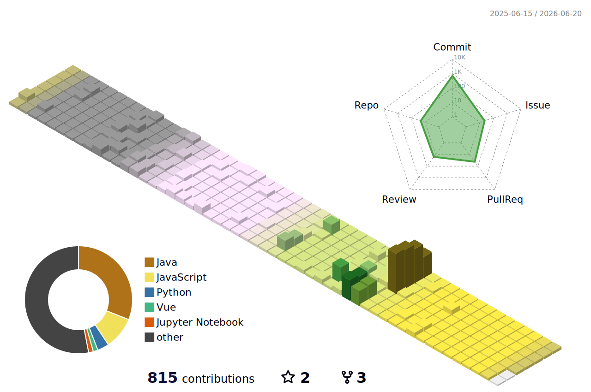

<!--
**chi980/chi980** is a ✨ _special_ ✨ repository because its `README.md` (this file) appears on your GitHub profile.

Here are some ideas to get you started:

- 🔭 I’m currently working on ...
- 🌱 I’m currently learning ...
- 👯 I’m looking to collaborate on ...
- 🤔 I’m looking for help with ...
- 💬 Ask me about ...
- 📫 How to reach me: ...
- 😄 Pronouns: ...
- ⚡ Fun fact: ...
-->

<h1> Hi there 👋 </h1>
Welcome to my github!

I'm Mieun Choi, who want to be a <strong>backend developer</strong>.

<h3>✏️ Once I've Used</h3>

<!--
<h3> 🛠️ Tools 🛠️ </h3>
visualstudiocode 
eclipse, intellij
-->

</a> 

<h3> 🌱 About Me </h3>

<a href = "https://github.com/chi980">
<a href = ""> https://velog.io</a>

<h3> 💻 Algorithm </h3>
<!--

-->
<h3> ✨ Dev log </h3>

